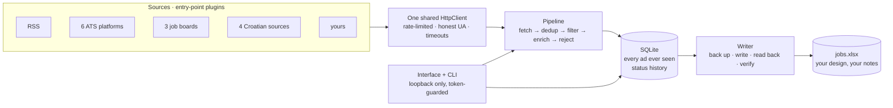

<div align="center">

# JobSheet

**Collect job ads from anywhere. Get a spreadsheet you actually own.**

[](https://github.com/antoniobubnic99/jobsheet/actions/workflows/ci.yml)
[](https://pypi.org/project/jobsheet/)
[](https://www.python.org/downloads/)
[](LICENSE)

A local-first desktop app that pulls vacancies from job boards, applicant
tracking systems and plain RSS feeds, then writes them into an Excel workbook
*you* design — your columns, your names, your colours — without ever destroying
the notes and ticks you added by hand.

**Nothing to sign up for. No API key. No data leaves your laptop.**

</div>

---

## Why

Most job trackers want you to live inside their web app, and the export button is
an afterthought that flattens everything you did. This one assumes the opposite:

> **The spreadsheet is the product. The app exists to keep it fed.**

The workbook is a first-class, editable artefact. Add a column, rename a header,
drag it somewhere else, recolour the whole table, type your own notes in a free
column — the next run picks up exactly where you left off and merges new ads in
*around* your edits.

That last promise is load-bearing, and there is a story behind it. The tool this
project grew out of once wiped 88 hand-placed ticks in a single run, because
re-sorting rewrote the sheet column by column instead of moving whole rows.
Nothing raised; nothing looked wrong; it was noticed days later. Read
[docs/EXCEL.md](docs/EXCEL.md) for what changed structurally so that it cannot
happen again.

---

## Install

```bash
pip install jobsheet
jobsheet                    # opens http://127.0.0.1:8765
```

**Windows, no Python:** there is a portable build for handing to someone who has
neither Python nor Node.

```powershell
powershell -ExecutionPolicy Bypass -File scripts\build-windows-zip.ps1
# -> build\JobSheet-windows.zip
```

They unpack it anywhere and double-click **Start JobSheet**. It carries its own
Python interpreter; nothing is installed, nothing is registered, nothing phones
home.

**macOS and Linux:** `scripts/make-launcher.sh` puts a double-clickable
`.command` on your Desktop, or a menu entry in `~/.local/share/applications`.

**From source:**

```bash
git clone https://github.com/antoniobubnic99/jobsheet.git
cd jobsheet
pip install -e ".[dev]"
cd web && npm install && npm run build && cd ..
jobsheet
```

Build the interface before the Python side — always `npm run build` first. The
reverse order succeeds and quietly ships a package whose interface is a
placeholder page.

---

## First run

JobSheet opens on a front page that says what it does, what comes out of it and
which sources it can reach on this install. Two buttons lead off it: one starts a
new search, one signs an existing account back in.

Starting a new search asks for a username and a password, and then asks eight
questions about the job you are after — what it is called, which
words mean it, where you would work, how old an ad may be, what you would rather
not see, where to look, and where the spreadsheet should live. Answer them and
you land on the search screen with all of it already filled in.

**The account is local and it is not a sign-up.** Nothing is registered
anywhere, nothing is verified, no address is asked for. It exists because one
install can hold several job searches that never see each other — a household
sharing a laptop, or a machine you demonstrate the app on — and because a page
in another browser tab should not be able to read your applications.

Be clear about what it does and does not protect:

| | |
|---|---|
| A web page you have open in another tab | **Cannot** reach your data. It cannot read the page JobSheet serves, so it cannot learn the session token, and the server refuses it. |
| Another person using this computer, in a browser | **Cannot** see your search. They get their own, or they get the sign-in screen. |
| Anyone with a shell on this computer | **Can** read everything. The database is an ordinary SQLite file and the command line opens it directly. A password cannot change that, and this one does not pretend to. |

Upgrading an install that predates accounts loses nothing. Everything already
there is held by an account with no password, which cannot be signed into — only
*claimed*, once, from the sign-in screen. Your workbook stays exactly where it
was.

```bash
jobsheet users                       # who is on this install
jobsheet users add ivo               # asks for a password, without echo
jobsheet --user ivo run remotive     # act as an account
```

`--user` may be left out whenever there is only one account, which is why a
single-user install behaves exactly as it did before. The command line does not
ask for the password: it reads the database file directly, so a prompt there
would be asking for a secret it has no way to insist on.

---

## What it does

Five screens: pick sources and say what you want; read what came back **and
why**; arrange the spreadsheet; track each application; see where your files are.
A sixth, once: the wizard that fills the first of them in for you.

The **sheet designer** is the centre of it — columns on the left, a live preview
on the right drawn to look like the workbook it will produce, and a write button
that reads your file before it touches it.

There is also a command line, so the whole thing is scriptable and a scheduled
task can refresh your spreadsheet overnight with no window open:

```bash
jobsheet sources                              # what is installed
jobsheet run remotive hzz --profile analyst   # search, save, write
jobsheet export                               # rewrite the workbook
jobsheet export csv --out jobs.csv            # or dump it elsewhere
jobsheet users                                # accounts on this install
```

### Where your things live

| What | Where |
|---|---|
| Workbook | `<home>/jobs.xlsx` |
| Database | `<home>/jobsheet.sqlite3` |
| Backups | `<home>/backups/` |

`<home>` is your platform's application-data directory, or wherever
`JOBSHEET_HOME` points. The Settings screen shows the real paths.

---

## Sources

Fourteen connectors ship with it. **None of them needs an API key or an
account** — that is a constraint on the project, not a stage it has not reached
yet.

| Source | Reach | Notes |
|---|---|---|
| **RSS / Atom** | anywhere | paste any job feed: a board, a company careers page, a public notice board |
| **Greenhouse** | global | any company whose careers page runs on Greenhouse |
| **Lever** | global | ditto |
| **Ashby** | global | ditto |
| **Workable** | global | ditto |
| **Recruitee** | global | ditto |
| **SmartRecruiters** | global | ditto |
| **Remotive** | global | remote jobs, mostly technology and English-speaking |
| **RemoteOK** | global | remote jobs; one request returns the whole board |
| **Arbeitnow** | Europe | many roles in Germany and Austria, including visa-sponsored ones |
| **HZZ Burza rada** | 🇭🇷 | every vacancy registered with the Croatian Employment Service, by county |
| **Posao.hr** | 🇭🇷 | the 30 newest ads, whole country |
| **Selekcija.gov.hr** | 🇭🇷 | public competitions for civil-service posts |
| **Narodne novine** | 🇭🇷 | public-sector vacancy notices in the official gazette — ⚠ **known issue**, see below |

> ⚠ **Narodne novine is currently broken.** Its result parsing has drifted
> against the site's present markup: the institution is never found, titles come
> back as sentence fragments, and the result count is identical at 30, 90 and 365
> days — so paging is not happening. The live test is marked `xfail` with the
> full measurement rather than deleted, because an open failure with an
> explanation is worth more than a tidy-looking list.
> [Help fixing it is welcome.](CONTRIBUTING.md)

---

## Add your own source in 30 lines

Sources are **plugins**, not a hard-coded list. A source declares the questions
it needs answered, and the interface builds its own form from that declaration —
so adding one touches no frontend code at all.

```python
from typing import Any

from jobsheet.core.dates import parse_date
from jobsheet.core.models import Posting
from jobsheet.sources.base import FetchContext, ParamSpec, Source, SourceError, SourceManifest


class AcmeSource(Source):
    manifest = SourceManifest(
        id="acme",
        name="Acme Jobs",
        homepage="https://acmejobs.example/",
        description="Open roles from the Acme public board.",
        rate_limit=1.0,
        params=[ParamSpec(name="team", label="Team", default="all")],
    )

    async def fetch(self, params: dict[str, Any], ctx: FetchContext) -> list[Posting]:
        payload = await ctx.http.get_json(
            f"https://api.acmejobs.example/v1/postings?team={self.param(params, 'team')}"
        )
        entries = payload.get("results") if isinstance(payload, dict) else None
        if not isinstance(entries, list):
            raise SourceError("Acme returned no job list")

        return [
            Posting(
                source_id="acme",
                title=job["title"],
                url=job["url"],
                company=job.get("employer", ""),
                location=job.get("city", ""),
                posted_at=parse_date(job.get("published")),
            )
            for job in entries[: ctx.max_items]
            if job.get("title") and job.get("url")
        ]
```

Then one line of packaging metadata in **your own** package:

```toml
[project.entry-points."jobsheet.sources"]
acme = "my_package.acme:AcmeSource"
```

`pip install` it and the source appears in the interface beside the built-ins.
There is no privileged internal list — the fourteen above register through
exactly this mechanism.

Full contract, worked example and the testing rules: **[docs/SOURCES.md](docs/SOURCES.md)**.

---

## How it fits together



Two chokepoints do most of the work. Every request to the outside world goes
through one HTTP client, so politeness is structural rather than something each
connector has to remember. Every write to your workbook goes through one `save()`
that proves afterwards it preserved your work, or restores the backup and refuses.

Full account: **[docs/ARCHITECTURE.md](docs/ARCHITECTURE.md)**.

---

## Design notes

**The writer never loses your work.** Every save is: refuse if the file is open →
count the user's values → back up → write → read back → verify → roll back on any
mismatch. Rows are sorted as whole objects and only ever written whole.

**The interface is served by the same process as the API.** One origin, no proxy,
no CORS. The server listens on `127.0.0.1`, checks the `Host` header so a hostile
domain cannot point its own DNS at loopback, and requires a per-process token
that it hands over by writing it into the page it serves. A page in another tab
can send requests to `127.0.0.1`; it cannot read that token.

**Sources are plugins.** See above. Third-party sources install as separate
packages and register through the `jobsheet.sources` entry-point group.

**Only public data.** JobSheet reads public RSS feeds and public job-board APIs,
respects `robots.txt`, rate-limits itself and identifies itself honestly. It does
not log in anywhere, does not solve captchas, and does not touch anything behind
an authentication wall.

**Live tests, not just recorded ones.** A recorded fixture goes stale along with
the service it recorded — green while the product is dead. That is not
hypothetical: one government API quietly started wrapping its array in an
envelope, the connector returned zero results to every user, and six recorded
tests kept passing. So every source also has a contract test against the real
endpoint, run nightly.

---

## Documentation

| | |
|---|---|
| [docs/ARCHITECTURE.md](docs/ARCHITECTURE.md) | layers, the pipeline, storage, the security model |
| [docs/SOURCES.md](docs/SOURCES.md) | the source contract, and how to write one |
| [docs/EXCEL.md](docs/EXCEL.md) | the workbook, the layout model, and the 88 ticks |
| [examples/](examples/) | a search profile and a sheet design, annotated |
| [CONTRIBUTING.md](CONTRIBUTING.md) | environment, tests, house rules |
| [CHANGELOG.md](CHANGELOG.md) | what changed, and the known issues |

---

## Licence

MIT — see [LICENSE](LICENSE).
