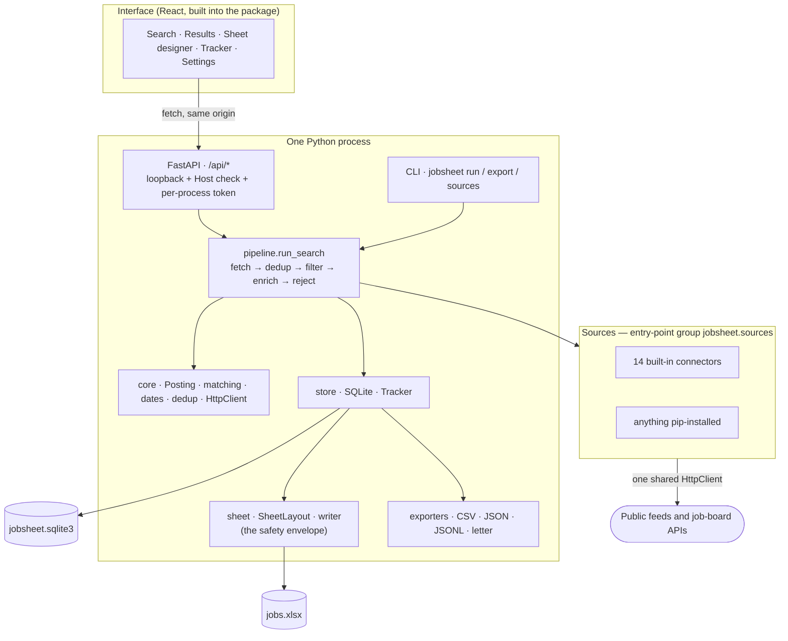

# Architecture

JobSheet has one organising idea, and everything below follows from it:

> **The spreadsheet is the product. The app exists to keep it fed.**

Most job trackers make you live inside their web application, and the export
button is an afterthought that flattens everything you did. Here the workbook is
the primary artefact — you design it, you edit it, you own it — and the software
is a well-behaved process that adds rows around your edits without touching them.

---

## The shape of it

Every arrow into the network goes through one shared `HttpClient`, and every
arrow into the workbook goes through one `save()`. Both chokepoints are
deliberate: politeness and data safety are properties of the architecture rather
than habits each connector has to remember.

---

## Layers

| Package | Holds | Depends on |
|---|---|---|
| `jobsheet.core` | `Posting`, keyword matching, date parsing, URL de-duplication, the HTTP client | nothing above it |
| `jobsheet.sources` | the `Source` contract, the registry, 14 connectors | `core` |
| `jobsheet.sheet` | `SheetLayout`, the workbook reader/writer, themes, checkboxes | `core` |
| `jobsheet.store` | SQLite schema, migrations, application tracking | `core`, `sheet` |
| `jobsheet.pipeline` | one search, end to end | all of the above |
| `jobsheet.exporters` | CSV, JSON, JSONL, covering-letter drafts | `core`, `sheet` |
| `jobsheet.api` | FastAPI routers, auth, serialisation, run bookkeeping | everything |
| `jobsheet.cli` | `serve`, `run`, `export`, `sources` | everything |
| `web/` → `jobsheet/web/` | the React interface, built into the Python package | the API only |

Nothing in `core` imports anything above it, which is why the matching rules and
the `Posting` model can be tested without a network, a database or a file.

---

## `Posting` is the only model

Every connector — an RSS feed, an applicant tracking system, a national
employment service — normalises whatever it scrapes into one frozen pydantic
model. Nothing downstream knows which site a row came from beyond a `source_id`
string.

That is what makes the source list open-ended. A new connector adds a file and an
entry-point line; it does not add a column, a branch in the writer, or a case in
the interface.

Two identity keys hang off it:

* **`dedup_key`** — the normalised URL, and the primary identity everywhere: in
  the spreadsheet, in the database's primary key, in the de-duplication pass. It
  carries **no scheme** (`example.test/j/1`, not `https://example.test/j/1`) and
  it is a `property`, so it is not in `model_dump`. That is why
  `api/serialize.py` exists — every endpoint that returns a row goes through it.
* **`secondary_key`** — a folded `(title, company)` pair, for boards that
  republish one vacancy under several ad numbers and therefore several URLs.

`merged_with` combines two sightings of the same job, preferring filled fields
and never dropping information: `self` wins on conflict, `other` only fills
blanks.

---

## One search, in five steps

`pipeline.run_search` is ordered to spend as few requests as possible on ads
nobody wants:

1. **Fetch** every source concurrently (`asyncio.gather`). A source that fails is
   recorded in `RunReport.errors` and skipped — one dead feed never takes the run
   down.
2. **De-duplicate** against what is already known, *before* anything expensive.
3. **Filter on keywords and location** — free, because it reads text already in
   hand.
4. **Enrich** only the survivors, and only for sources whose manifest says there
   is more to get. This is the one step that costs a request per ad, so it is
   last and it is capped (`max_enrich`, default 40).
5. **Apply the hard filters**, which need the enriched fields to mean anything.

Anything rejected is kept in `RunReport.rejected` with a stable reason code
rather than silently dropped, so a user who expected an ad to appear can be shown
why it did not.

> ⚠ **The keyword filter runs before enrichment.** Some feeds ship items with an
> empty title — the Croatian employment service does it for about a quarter of
> its items, in runs — and the title exists only on the ad's own page. Such ads
> can be caught only through their description. If someone reports "source X
> never finds Y", this ordering is the first place to look.

---

## Matching

Two phases, mirroring the pipeline's cheap/expensive split: `match()` over title
and description, then `rejection_for()` over the detail fields.

Two rules were earned through false positives and are kept deliberately:

* **Keywords are never matched against the source's own category.** National
  employment services staple broad categories onto every ad — one real example
  was `CIVIL ENGINEERS, ARCHITECTS, SURVEYORS` — which turns a bricklayer vacancy
  into a surveying match.
* **A hit found only in the description is weaker than a hit in the title.** A
  profile can demand extra evidence for those via `description_match_requires`.

Terms are folded (lower-cased, diacritics stripped) and compiled to a pattern
anchored at the start of a word but **not** at the end: `survey` covers surveyor,
surveying and surveys without the user listing inflections, while `gis` cannot
hide inside `logistics`. That start-anchoring matters far more in heavily
inflected languages than in English.

`location_matches` lets the place of work decide alone, and consults a region
only when no place is given at all. That is not fussiness: on one government
portal the region field holds the address of the *publishing authority*, and 27%
of its listings say "Zagreb" for work in Split, Osijek or on an island.

---

## Storage: two layers, on purpose

| | Workbook | Database |
|---|---|---|
| Path | `<home>/jobs.xlsx` | `<home>/jobsheet.sqlite3` |
| Role | what the user works in | what the app remembers |
| Holds | current rows, the user's ticks and notes | every posting ever seen, status history, run history, source health, saved profiles |

A spreadsheet is easy to reason about and easy to edit, but it cannot hold a
history — and a user who deletes a row should not thereby lose the record that
they applied for that job in June. Hence both.

Migrations are a plain list applied in order and tracked by SQLite's own
`user_version`. Four tables do not justify a migration framework.

Two rules keep the layers from fighting:

* **`save_row` never changes a status.** Status is the user's claim about the
  world; re-fetching an ad cannot un-apply them from a job. Status changes go
  through `Tracker.set_status`, which also records when it happened.
* **A row the database has never seen is adopted, not rejected.** Someone pastes
  a row into the workbook by hand, or opens an old workbook against a new
  database; `Tracker.knows()` guards the insert and `merge_from_sheet` adopts the
  stranger as `NEW`. Before that guard existed, this raised a `FOREIGN KEY` error.

`upsert_posting` uses `COALESCE` to keep dates a later fetch lost. Feeds drop
fields; deleting a deadline we already knew is data loss.

`<home>` is the platform's application-data directory (`%LOCALAPPDATA%\JobSheet`,
`~/Library/Application Support/JobSheet`, `$XDG_DATA_HOME/jobsheet`), or whatever
`JOBSHEET_HOME` points at — which is how the portable Windows ZIP keeps
everything beside the executable.

---

## The workbook, briefly

The full account is in [EXCEL.md](EXCEL.md). The architectural part:

* One `SheetLayout` object describes the spreadsheet. Header labels, widths,
  autofilter range, conditional-formatting range and checkbox columns are all
  *derived* from it, never restated.
* The layout is embedded in the file's own custom document properties, so a
  workbook the user rearranged by hand still reads correctly on the next run.
* Columns are either source-owned (refreshed every run) or **user-owned**
  (carried across, counted before and after, with the whole save rolled back if
  the counts differ).
* Rows are sorted and written **as whole objects**. Cells are never moved
  independently. This is the single most important line in the codebase, and
  [EXCEL.md](EXCEL.md) explains what it cost to learn.

---

## The interface, and why it is safe on loopback

One process serves both the API and the built React app, from the same origin. No
proxy, no CORS, no second server. A user with no Node and no Python double-clicks
a launcher and a browser window opens.

`127.0.0.1` alone is **not** privacy. Any page in any tab can send a request to
`http://127.0.0.1:8765`, and the browser will deliver it. Three things close
that:

1. **A per-process token**, minted at start-up and handed to the interface by
   embedding it in the page JobSheet itself serves. A cross-origin page cannot
   read that page — no CORS headers are sent, deliberately — so it cannot learn
   the token. It is also accepted as a query parameter, because `EventSource`
   (the live progress stream) cannot send custom headers; that concession is
   confined to that one mechanism.
2. **A `Host` check.** A hostile domain can point its own DNS at `127.0.0.1`,
   which makes the browser treat this server as same-origin for that domain.
   Requests whose `Host` is not loopback are refused.
3. **A strict CSP plus `nosniff`, `no-referrer` and `frame-ancestors 'none'`.**
   The interface loads nothing from anywhere else, so it says so; anything
   reaching for the network from inside the page is a bug or an intrusion, and
   either way it should fail loudly.

Two smaller guards live in the same file:

* Static paths are `resolve()`d and checked with `is_relative_to`, because `../`
  in a URL is exactly how a static handler leaks a private key.
* Media types are registered explicitly at import time. Windows resolves them
  through the registry, where an installer can leave `.js` mapped to
  `text/plain` — the browser then refuses to run the module and the interface is
  a blank page, **with nothing in the server log to say so**.

`/api/health` is the one unauthenticated route: it says only that the server is
up, and the launcher polls it to learn which port was chosen.

---

## Politeness is enforced, not requested

Sources never construct their own HTTP client — they are handed one on the
`FetchContext`. Any connector can be written carelessly; none of them can be
rude, because none of them own the socket.

* a per-host delay (`rate_limit`, raised for small servers)
* a User-Agent that names the project and links to it, so an administrator who
  sees the traffic can find out what it is and who to tell if they object
* a timeout on everything, so one unresponsive host cannot hang a run
* `max_items` and `max_enrich` ceilings per run

JobSheet reads public feeds and public job-board APIs only. It does not log in
anywhere, does not solve captchas, and touches nothing behind an authentication
wall. `SourceManifest.needs_credentials` exists, and every source shipped here
has it `False` — that is a constraint, not an accident.

---

## Testing, and why there are two kinds

Recorded fixtures (`respx`) cover parsing: fast, deterministic, runnable
anywhere.

But **a recorded fixture that went stale along with the service is the worst
possible test** — green while the product is dead. That is not hypothetical. One
government API started wrapping its array in `{"Records": [...]}`; the connector
raised on a dict, returned zero results to every user, and all six recorded tests
kept passing.

So `tests/test_sources_live.py` exists: one contract test per source against the
real endpoint, marked `network`, run nightly rather than on every push. It never
asserts a *number* of results — a test that fails because a board had a quiet week
is a test people learn to ignore.

`addopts = "-m 'not network'"` means a plain `pytest` never calls anyone.

---

## Packaging: the trap worth knowing

The interface is a build artefact, so `.gitignore` hides it — and **hatchling
honours `.gitignore`**. Without the two `artifacts` lines in `pyproject.toml`,
`pip install .` produces a perfectly valid package whose server greets the user
with "the interface has not been built". Nothing in the build fails.

Three things hold that shut, and they are a set:

* `artifacts = ["/src/jobsheet/web/**"]` for both wheel and sdist
* `tests/test_packaging.py`, which builds a real wheel and a real sdist and looks
  inside them
* `JOBSHEET_ASSERT_PACKAGED_WEB=1` in CI, which turns "the frontend was never
  built" from a skipped test into a failure

**Build order is always `npm run build` first, then `python -m build`.** The
reverse succeeds and ships a blank page.

---

## Further reading

* [SOURCES.md](SOURCES.md) — the source contract, and how to write one
* [EXCEL.md](EXCEL.md) — the workbook, the layout model, and the 88 ticks
* [../CONTRIBUTING.md](../CONTRIBUTING.md) — environment, tests, house rules
